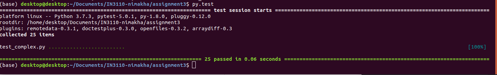

## Mandatory Assignment 3 Basic Python programming

#### Assignment 3.1 wc

To run the wc.py script, either run `chmod a+x wc.py` and then run `./wc.py filename`
or run `python wc.py filename`

Example: `./wc.py testfile.txt`

#### Assignment 3.2 Unit tests for complex numbers

To run the tests, Call `py.test` in the 'assignment3' folder

Expected result

#### Assignment 3.3 Implement complex numbers

No steps needed

#### Assignment 3.4 Make your implementation work with Python’s complex numbers

No steps needed