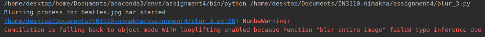
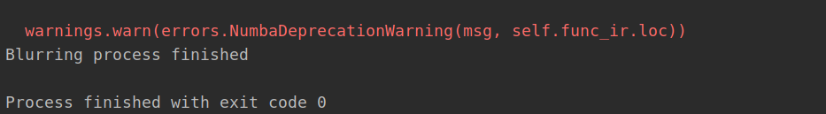

# Mandatory Assignment 4

### Intro

In this assignment we are making a python program for blurring images using different libraries to 
compare efficiency. 
We are going to take in an image, run it through different implementation of blurring and optionally storing the blurred version.
We also store the time spent on the different implementations 
I was unfortunately not able to complete all he parts of the assignment.

### 1 Python implementation

This version of the implementation uses plain python. 
Run time with this implementation was in my testing about 7.7s  

To run the program use the added blur script. 
First make the blur.py file executable: chmod +x blur.py 
Then run: python blur.py 1 "beatles.jpg" "blurred_beatles.jpg" 
The last argument is optional  

### 2 Numpy implementation

This version of the implementation uses numpy. 
In my testing the run time went from about 7.7s to 0.3s  

To run the program use the added blur script. 
First make the blur.py file executable: chmod +x blur.py 
Then run: python blur.py 2 "beatles.jpg" "blurred_beatles.jpg" 
The last argument is optional 

### 3 Numba implementation

This version of the implementation uses numba. 
With numba the run time actually went up. from about 7.7s to 8.5 this must be retested after troubleshooting 

This implementation did not work as intended. It is not possible to run with python command. 
Running from IDE(Intellij) would finnish the process though with warnings. 
 

 

I did not have more time to troubleshoot this

### 4 Cython implementation

This version of the implementation uses cython. 
With cython run time went from about 7.7s to 5.3s  

There are two ways to run this script: 

1 To run the program use the added blur script. 
First make the blur.py file executable: chmod +x blur.py 
Then run: python blur.py 2 "beatles.jpg" "blurred_beatles.jpg" 
The last argument is optional 

2 Use interactive python. 
first run ipython 
then import blur_4: import blur_4 
then run: blur_4.run("beatles.jpg")

### 5 User interface
For this task we are making a simple command line interface using argparse. 
Usage: python blur.py method_type source destination 
method type = which blur script to use. 1 = blur_1 2 = blur_2 ...  
source = full image name with suffix  
destination (optional) = image name for blurred version
