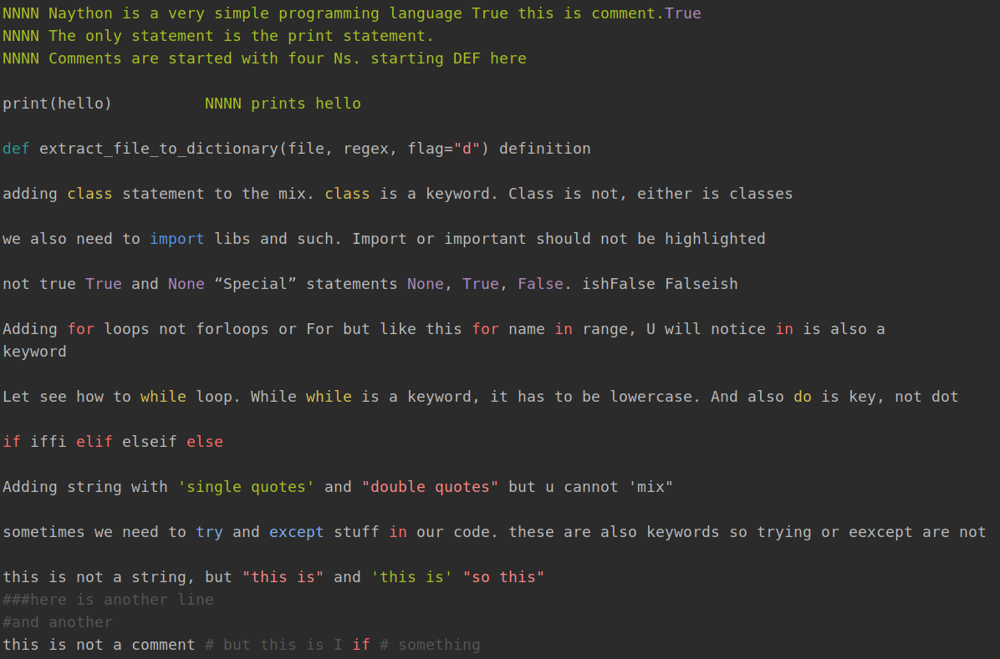
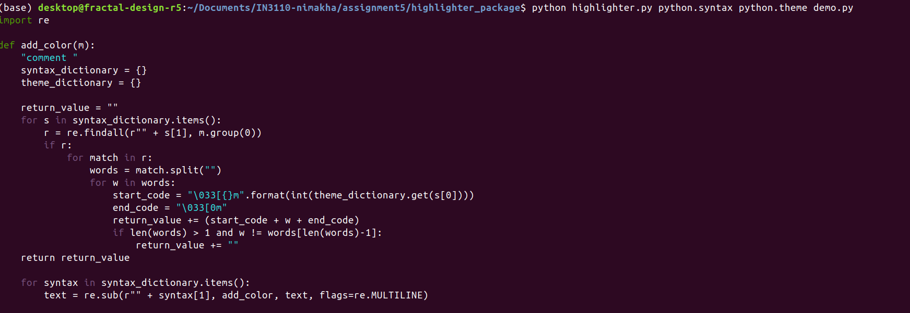
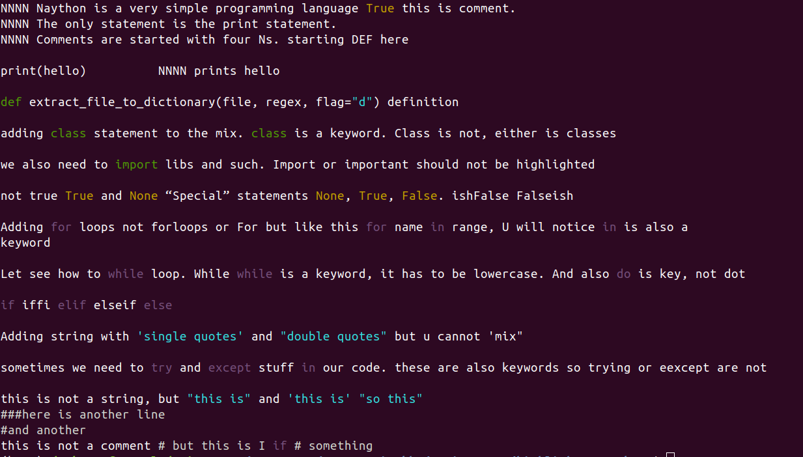
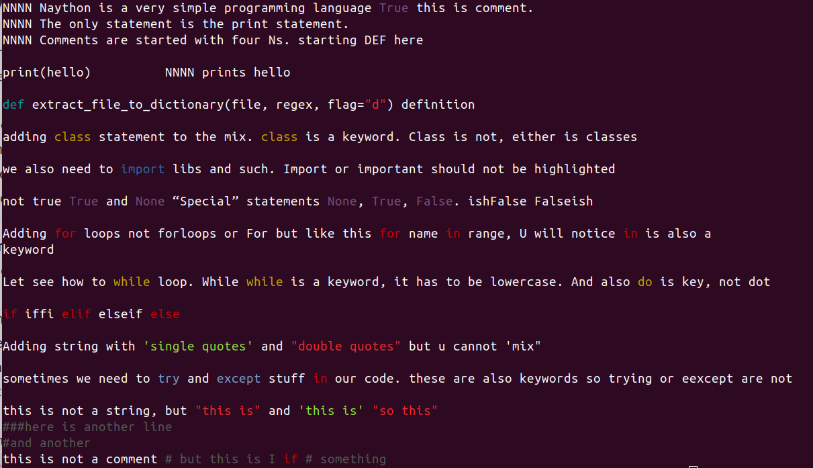
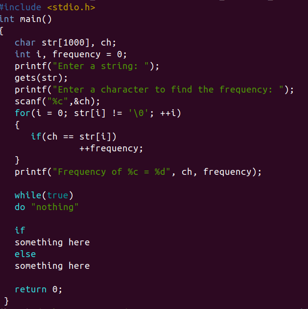
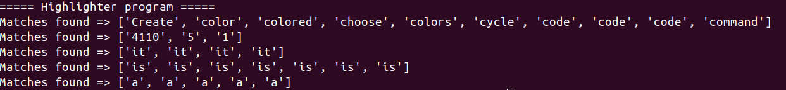
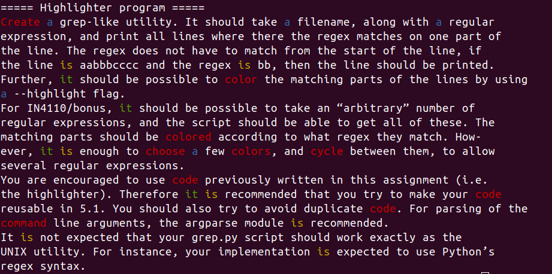
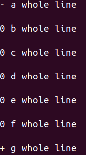
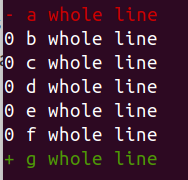

# Highlighter Assignment 5
For this assignment we are focusing on regular expressions.

# 5.1 Syntax highlighting

In this task we are making a syntax highlighter. The program should be able to take in 3 parameters syntax file, theme file and source file and output to terminal the result. One syntax should have a matching theme.  
We were also tasked to find a solution for overlapping regex in for instance comments. I did not find a good solution for this, the furtherst I came was that keywords in strings will not be highlighted, but if the keyword is the last word it still gets highlighted. Example is first line in image below 
To run the program first, from root, run `pip install . --user` to install packages. Then we are going to use the files in the "highlighter_package". 
To run the program run `python highlighter.py syntax_file theme_file source_file` 
example `python highlighter.py naython.syntax naython.theme hello.ny` 

# 5.2 Python syntax

In this task we are making python theme and syntax files. Files for this assignment are in the "highlighter_package"
The key elements/values I have chosen to highlight are:

 1. **Comments** (theme name = hashtag_comment)
 2. **Function definitions** (theme name = function_definition)
 3. **Class definitions** (theme name = class_definition)
 4. **Strings** (theme name = double_quote_string/single_quote_string)
 5. **Imports** (theme name = import_definition)
 6. **“Special” statements None, True, False** (theme name = special_statement)
 7. **Try/except** (theme name = try_statement)
 8. **for-loops** (theme name = for_loop)
 9. **while-loops** (theme name = while_loop)
 10. **if/elif/else blocks** (theme name = if_loop)
 11. **Single quot strings** (theme name = single_quote_string)
 12. **Double quot strings** (theme name = double_quote_string)

To run script run `python highlighter.py python.syntax python.theme demo.py` 

Can also test with hello.ny `python highlighter.py python.syntax python.theme hello.ny` 

I also created another python theme, `python highlighter.py python.syntax python2.theme demo.py` 

# 5.3 Syntax for your favorite language

In this task we are making alternative syntax and theme files based on our favorite language. 
All files for this assignment are in the "favorite_language_package". I have chosen to make syntax highlighter for the C programing language. 
Key elements/words that I have highlighted are: 

 - **import** (theme name = import_definition)
 - **Import name** (theme name = import_name)
 - **“Special” statements null, true, false** (theme name = special_statement)
 - **Single quot strings** (theme name = single_quote_string)
 - **Double quot strings** (theme name = double_quote_string)
 - **Double slash comments** (theme name = comment)
 - **int, char, float, double, short, long, void** (theme name = data_types)
 - **Different loops** (theme name = loops)

To run script run `python ../highlighter_package/highlighter.py favorite_language.syntax favorite_language.theme favorite_language_demo.c` 

# 5.4 grep
For this task I needed some extra clarification. So after consulting piazza I understood this task to be that we are making a grep like utility that will take regex and file as input. 
This script will have two functions, one will return the findings of the regex, the other will highlight the words with color chosen by the program and output the result in the terminal. 
**Function 1**: 
For this script we are using the argparse interface. From the "assignment5" folder run `python interface.py filename regex` 
Example `python interface.py grep_package/grep_demo "\b[C|c]\w+" "\d+" "\bit\b" "\bis\b" "\ba\b"` 

**Function 2** 
This functions adds the --highlighter flag to highlight findings. Run `python interface.py filename regex --highlight` 
Example `python interface.py grep_package/grep_demo "\b[C|c]\w+" "\bit\b" "\bis\b" "\ba\b" --highlight` 

# 5.5 superdiff
For this assignment we are making a program that takes two files as input and outputs the difference. 
Files for this task are in the "superdiff_package". 
To run the program run `python diff.py original_file modified_file output_file` 
Example `python diff.py superdiff_demo_original.txt superdiff_demo_modified.txt result.txt` 

# 5.6 Coloring diff
For this assignment we are adding syntax and them files for the superdiff. 
With these files the removed content will be colored red and the added content green. 
Files for this task are in the "superdiff_package". To run the program use the highlighter.py script. 
Example `python ../highlighter_package/highlighter.py diff.syntax diff.theme result.txt` 

