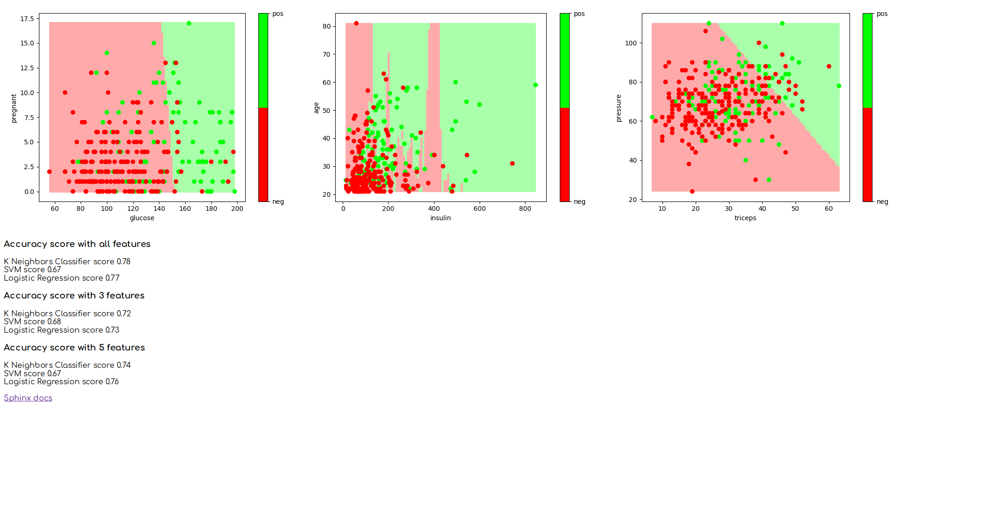

# Assigment 6  
For this assignment we are performing machine learning techniques on a dataset using Pandas.   
We are also making a simple web-interface using Flask.   
  
Development environment:   
 - Ubuntu 18.04 64-bit   
 - Python 3.7   
 - IntelliJ IDEA 2019.2.4 (Ultimate Edition)   
 - Linux 5.2.3-050203-generic 

Before you start, from the root folder (assignment6) run

    pip install . --user
    pip install -r requirements.txt

## Handling the data
This script takes 3 arguments, csv file, first feature and second feature and returns a scatter plot 
image of both training and validation sets. 

    python data.py csv_file first_feat second_feat

**Usage** 
For these examples you need to be in the 'handling_the_data' directory. 

    cd handling_the_data/

To get see the features insulin and age 
run `python data.py ../diabetes.csv insulin age` 
**Expected result** 

 
Or to get features glucose and pregnant 
run `python data.py ../diabetes.csv glucose pregnant` 
Expected result 

 

## Fitting a machine learning model
This script runs the fitting process of machine learning on 3 different feature subsets. 
It does this using 3 different machine learning algorithms K neighbor, Logistic Regression and Support vector machine. 
The script runs with 3, 5 and all features. I have not extended the script for user input. 
**Usage**
For these examples you need to be in the 'fitting_machine_learning_model' directory. 

    cd fitting_machine_learning_model/
   then run `python fitting.py`

**Expected result** 
 

## Visualizing the classifier
This script can visualize the classifier when the chosen feature subset has only 2 features. 
This script is also not extended for user input. 
The script uses these classifiers
- insulin and age
- glucose and pregnant
- triceps and pressure

**Usage**
For these examples you need to be in the 'visualizing_the_classifier' directory. 

    cd visualizing_the_classifier/

then run `python visualize.py` 
**Expected result** 

 

## Visualization through a web app
This script uses Flask to run a simple web-interface showing the results of 'Fitting a machine learning model' and 'Visualizing the classifier' 
**Usage**
For these examples you need to be in the 'visualization_through_web_app' directory. 

    cd visualization_through_web_app/
Then to start server run `python web_visualization.py` 
You should then be able to go to localhost:5001 in your browser. 
To close server pres 'ctrl+c'
**Expected result** 

## Interactive visualization
Did not have enough time to finish this task

## Documentation and help pages
Fro this task we are making a documentation page auto-generated from our docstrings. 
We where free to chose the tool to do this and have chosen Sphynx. 
The page is already generated. 
**Usage**
To get access to the documentation page you need to start the server as in 'Visualization through a web app'. 
First go to the 'visualization_through_web_app' directory. 

    cd visualization_through_web_app/
Then run the server `python web_visualization.py` 
At the bottom of the page there is a 'Sphinx docs' link 

**Expected result** 

To close server pres 'ctrl+c'